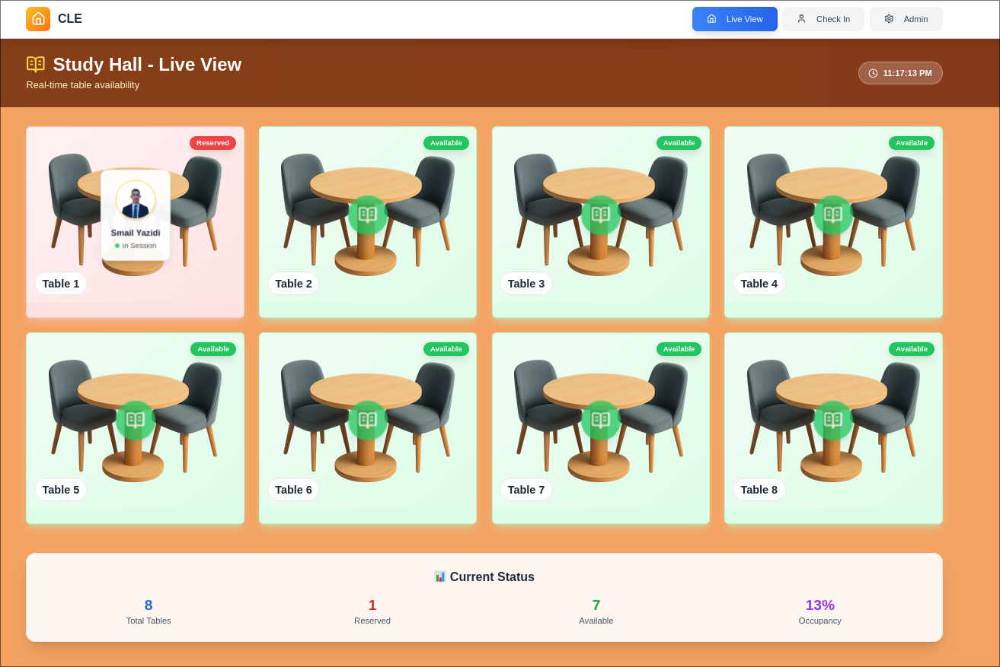
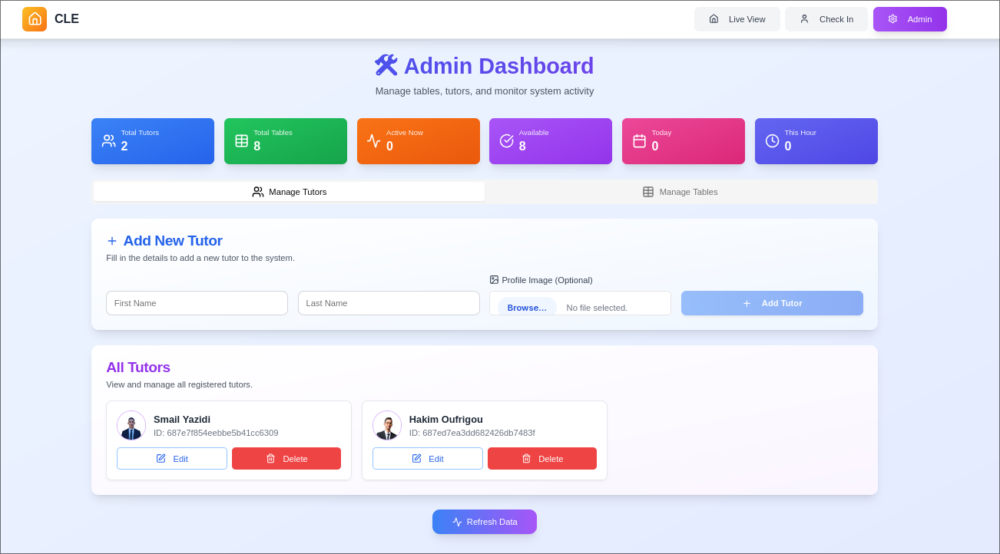

# Table Management System

A modern, real-time table reservation system designed for study halls, libraries, and tutoring centers. Built with Next.js, TypeScript, and a sleek UI.

## 🌟 Live Demo

**[View Live Application](https://table-management-system-five.vercel.app/)**

## 📱 Screenshots

*Caption: Main application interface showing live table status*



## 📖 Overview

This system provides a comprehensive solution for managing table reservations with three main interfaces:

- **Live View**: Real-time table status display
- **Check In**: Tutor reservation interface  
- **Admin Dashboard**: Complete system management

## ✨ Features

### 🎯 Real-Time Table Monitoring
- Live table availability status
- Automatic reservation cleanup
- Visual table occupancy indicators
- Responsive grid layout for all screen sizes

### 👤 Tutor Check-In System
- Name-based tutor identification
- Smart reservation conflict detection
- Available table selection
- Intuitive multi-step flow with animations

### 🛠️ Admin Dashboard
- Complete tutor management (add, edit, delete)
- Table management system
- Image upload for tutor profiles (Vercel Blob integration)
- Real-time statistics and metrics
- Reservation monitoring

### 🎨 Modern UI/UX
- Gradient backgrounds and modern design
- Smooth animations and transitions
- Mobile-first responsive design
- Loading states and error handling
- Dark/light theme elements

## 🚀 Tech Stack

- **Frontend**: Next.js 14, React, TypeScript
- **UI Components**: shadcn/ui, Tailwind CSS
- **Icons**: Lucide React
- **Styling**: Tailwind CSS with custom gradients
- **Deployment**: Vercel
- **File Storage**: Vercel Blob (for tutor profile images)
- **HTTP Client**: Axios


## 🛠️ Installation & Setup

1. **Clone the repository**
```bash
git clone https://github.com/smail-yazidi/Table-Management-System.git
cd Table-Management-System
```

2. **Install dependencies**
```bash
npm install
# or
yarn install
```

3. **Environment Setup**
Create a `.env.local` file with your configuration:
```env
NEXT_PUBLIC_API_BASE_URL=your_api_base_url
BLOB_READ_WRITE_TOKEN=your_vercel_blob_token
```

4. **Run the development server**
```bash
npm run dev
# or
yarn dev
```

5. **Open [http://localhost:3000](http://localhost:3000)** in your browser

## 📋 API Requirements

This frontend expects a backend API with the following endpoints:

- `GET /api/tutors` - Fetch all tutors
- `POST /api/tutors` - Create new tutor
- `PUT /api/tutors/:id` - Update tutor
- `DELETE /api/tutors/:id` - Delete tutor
- `GET /api/tables` - Fetch all tables
- `POST /api/tables` - Create new table
- `DELETE /api/tables/:id` - Delete table
- `GET /api/reservations` - Fetch all reservations
- `POST /api/reservations` - Create new reservation
- `GET /api/tables-with-reservations` - Fetch tables with current reservations
- `POST /api/delete-old-reservations` - Cleanup expired reservations

## 🎨 Key Features Breakdown

### Live View Page
- Real-time table status updates every 10 seconds
- Automatic old reservation cleanup every 30 seconds
- Reserved tables show tutor information and profile images
- Available tables display with animated indicators
- Summary statistics at the bottom

### Tutor Check-In Flow
1. **Welcome Screen** - Animated greeting
2. **Name Input** - Full name verification
3. **Loading State** - Search animation
4. **Existing Reservation Check** - Conflict detection
5. **Table Selection** - Available tables only
6. **Success Confirmation** - Reservation complete

### Admin Dashboard
- **Statistics Cards** - Live metrics with gradient designs
- **Tutor Management** - Full CRUD operations with image upload
- **Table Management** - Add/remove tables
- **Real-time Updates** - Automatic data refresh

## 🔧 Customization

The system uses a modular design allowing easy customization:

- **Colors**: Modify gradient schemes in Tailwind classes
- **Animations**: Custom CSS animations defined in style tags
- **Layout**: Responsive grid systems throughout
- **API Endpoints**: Centralized in `config/api.ts`

## 🚀 Deployment

The application is optimized for Vercel deployment:

1. Connect your GitHub repository to Vercel
2. Set environment variables in Vercel dashboard
3. Deploy automatically on push to main branch

## 📄 License

This project is open source. Feel free to use and modify according to your needs.

## 🤝 Contributing

1. Fork the repository
2. Create a feature branch (`git checkout -b feature/amazing-feature`)
3. Commit your changes (`git commit -m 'Add some amazing feature'`)
4. Push to the branch (`git push origin feature/amazing-feature`)
5. Open a Pull Request

## 📞 Support

For questions or support, please open an issue on GitHub.

---

Built with ❤️ using modern web technologies